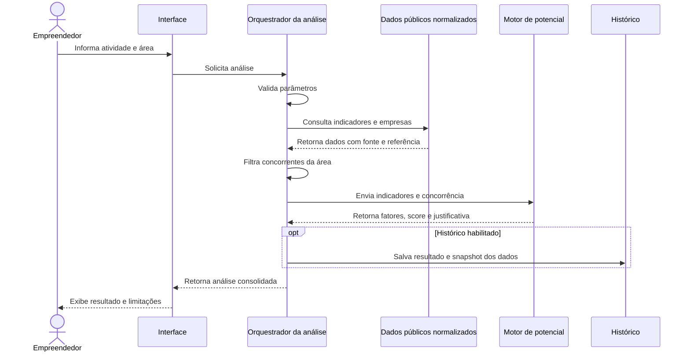

# Fluxo de Dados - RightPoint

## Fluxo principal da análise

## Transformações dos dados

1. **Entrada:** atividade e referência geográfica informadas pelo usuário.
2. **Normalização da atividade:** associação com CNAE ou categoria equivalente.
3. **Delimitação da área:** resolução da região ou aplicação do raio às coordenadas.
4. **Coleta:** obtenção de indicadores e estabelecimentos das fontes adotadas.
5. **Normalização externa:** conversão dos formatos de origem para o modelo do RightPoint.
6. **Concorrência:** seleção de estabelecimentos compatíveis e geograficamente elegíveis.
7. **Pontuação:** cálculo das contribuições de cada fator e do score final.
8. **Explicação:** produção da justificativa a partir das contribuições registradas.
9. **Persistência:** armazenamento do resultado e do snapshot, quando aplicável.

## Dados que exigem rastreabilidade

- fonte e data de referência de cada indicador;
- versão ou data da base de estabelecimentos;
- critérios usados para reconhecer concorrentes;
- pesos e versão da fórmula de score;
- fatores citados na justificativa;
- data e parâmetros da análise.

## Falhas previstas

| Situação | Comportamento esperado |
| --- | --- |
| Atividade não reconhecida | Solicitar correção ou seleção de atividade válida. |
| Região ou localização inválida | Interromper a análise e informar o campo inconsistente. |
| Fonte externa indisponível | Informar indisponibilidade ou usar dados previamente atualizados, se existirem. |
| Dados insuficientes | Sinalizar a limitação conforme `RN-017`. |
| Estabelecimento sem localização | Excluí-lo da análise por raio ou tratá-lo conforme regra ainda `A CONFIRMAR`. |
