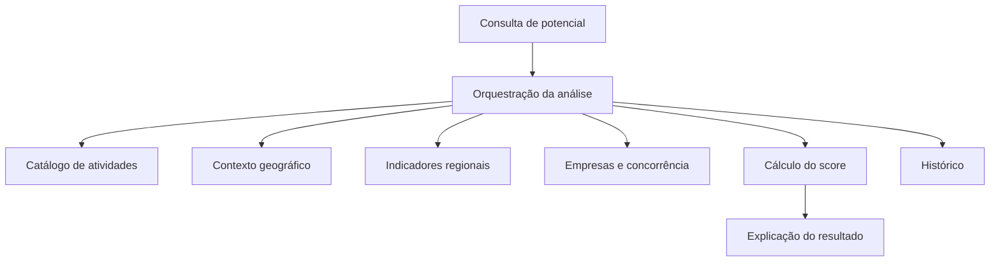

# Mapa de Serviços - RightPoint

## Interpretação

Neste documento, serviço significa uma responsabilidade lógica do sistema. Ele não implica a adoção de microsserviços. Na implementação inicial, essas responsabilidades podem existir como módulos de uma única aplicação.

## Mapa conceitual

## Responsabilidades e entradas

| Serviço lógico | Entradas principais | Saídas principais |
| --- | --- | --- |
| Consulta de potencial | Atividade, região ou localização, raio | Solicitação validada e resultado exibido |
| Orquestração da análise | Solicitação validada | Coordenação das etapas e análise consolidada |
| Catálogo de atividades | Nome, categoria ou CNAE | Atividade normalizada e relações equivalentes |
| Contexto geográfico | Região, coordenadas e raio | Área analisada e distâncias |
| Indicadores regionais | Área e data de referência | População, renda, densidade, faixa etária e outros indicadores |
| Empresas e concorrência | Atividade e área | Estabelecimentos elegíveis e contagem de concorrentes |
| Cálculo do score | Indicadores e concorrência | Fatores, contribuições e score |
| Explicação do resultado | Fatores calculados | Justificativa coerente com o score |
| Histórico | Resultado completo | Snapshot consultável da análise |

## Dependências externas previstas

- fonte de CNAE e cadastro de empresas;
- fonte de indicadores socioeconômicos;
- dados geográficos ou mecanismo de geocodificação;
- fonte climática, caso o clima permaneça no escopo.

Todas as fontes específicas estão `A CONFIRMAR`.
