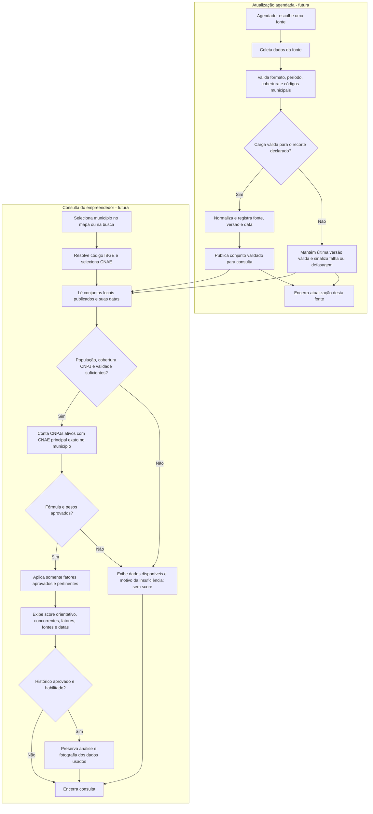

# Matriz de dados e fluxograma do diagnóstico — RightPoint

Atualizado em 06/10/2026. Este documento orienta a implementação futura; **não descreve uma integração ou um score já funcionando**. As fontes pesquisadas e os dois testes exploratórios do IBGE estão em [FONTES_DADOS.md](../FONTES_DADOS.md).

## Recorte e critérios da primeira versão

- Cobertura pretendida: os **92 municípios do estado do Rio de Janeiro**. Busca por nome e clique no mapa devem selecionar o mesmo `codigo_ibge` de sete caracteres. Bairro, ponto e raio ficam para uma etapa posterior.
- Entrada da consulta: município e atividade identificada por CNAE. O mapa municipal deverá usar limites de uma edição identificada da [Malha Municipal do IBGE](https://www.ibge.gov.br/geociencias/organizacao-do-territorio/malhas-territoriais/15774-malhas.html); OpenStreetMap/Mapbox são apoios visuais possíveis, não fontes de limites nem fatores automáticos do score.
- Dados mínimos **propostos** para um futuro score: população municipal do IBGE e cobertura validada de estabelecimentos/CNPJ no município. A contagem inicial de concorrentes proposta considera situação **ativa** e **CNAE principal idêntico** ao consultado, no mesmo município. CNAEs secundários/equivalentes e outras situações ficam fora dessa primeira contagem até decisão do grupo.
- O score de 0 a 100 só poderá ser apresentado após aprovação da fórmula, pesos e critérios de atualização. É uma nota orientativa, **não** uma probabilidade estatística de sucesso. Enquanto faltarem dados mínimos ou fórmula aprovada, mostrar indicadores disponíveis e o motivo de não haver score.
- Dados condicionais podem ajudar a explicar o contexto, mas só entrarão no cálculo após validação da fonte, pertinência para a atividade e regra de uso. Nenhum dado ausente será substituído silenciosamente por zero.

## Matriz de fontes e indicadores

`Proposto` significa que a fonte, o indicador ou sua regra ainda dependem de validação. `Validado` exigirá fonte, licença/acesso, recorte, período, unidade, cobertura, vínculo municipal e regra de uso conferidos. `Integrado` exigirá importação e consulta testadas no sistema. Os dois endpoints exploratórios do IBGE **não** validam por si só a cobertura completa dos indicadores nem tornam uma fonte integrada.

| ID | Fonte e dado | Unidade | Município/associação | Período de referência | Atualização local | Uso no score proposto | Estado atual |
| --- | --- | --- | --- | --- | --- | --- | --- |
| M-01 | IBGE Localidades: código e nome | Não se aplica | 92 códigos IBGE do RJ | Data/versão da consulta a registrar | Sem carga; registrar data/hora em cada carga | Não; catálogo e seleção | Proposto; consulta exploratória retornou 92 |
| M-02 | IBGE Malha Municipal: limites | Geometria | Associar polígono ao código IBGE | Edição da malha a selecionar | Sem carga; registrar edição e data/hora | Não; mapa | Proposto |
| M-03 | IBGE Censo/SIDRA: população | Pessoas | Um valor por código IBGE do RJ | Censo 2022 é candidato; somente Rio de Janeiro foi testado | Sem carga; registrar data/hora e período | Sim; dado mínimo proposto | Proposto; teste de um município |
| M-04 | IBGE: densidade populacional | Habitantes/km² | Mesmo código e períodos compatíveis para população e área | Tabela/edição a confirmar | Sem carga; registrar data/hora | Condicional, após validação | Proposto |
| M-05 | IBGE: renda | Conceito e unidade a escolher | Um valor por código IBGE, se houver cobertura municipal | Tabela/período a confirmar | Sem carga; registrar data/hora | Condicional à atividade e à regra aprovada | Proposto |
| M-06 | IBGE: perfil etário | Faixas e unidade a escolher | Um valor por código IBGE, se houver cobertura municipal | Tabela/período a confirmar | Sem carga; registrar data/hora | Condicional à atividade e à regra aprovada | Proposto |
| M-07 | Receita Federal/CNPJ ou provedor validado: estabelecimentos e concorrentes | Estabelecimentos; CNPJ como identificador textual | Mapear código de município da fonte para código IBGE; deduplicar CNPJ | Data/versão da base CNPJ a registrar | Sem carga; registrar data/hora e versão | Sim; concorrência ativa com CNAE principal exato | Proposto; arquivo/endpoint não escolhido |
| M-08 | ANP: preços de combustíveis | Unidade da série escolhida a confirmar | Cobertura municipal a verificar | Série/período a escolher | Sem carga | Não inicialmente; contexto, sem inferir fluxo de pessoas | Proposto |
| M-09 | INMET: temperatura | °C | Definir método para associar estação a município | Série/período a escolher | Sem carga | Condicional à atividade e à validação espacial | Proposto |
| M-10 | INMET: chuva | mm | Definir método para associar estação a município | Série/período a escolher | Sem carga | Condicional à atividade e à validação espacial | Proposto |
| M-11 | SICONFI ou Obrasgov: investimento/obras | Medida e unidade a escolher | Verificar identificação e cobertura por município | Exercício/período a escolher | Sem carga | Não inicialmente; contexto, sem presumir valorização | Proposto |
| M-12 | OpenStreetMap/Mapbox: base cartográfica/POIs | Não se aplica nesta fase | Visualização associada ao município selecionado | Licença/edição a verificar | Sem integração | Não | Proposto; uso opcional |

Cada **registro de indicador efetivamente usado** deverá guardar tipo, valor, unidade quando couber, `codigo_ibge`, período de referência, fonte, versão/data da base e data da atualização local. Para uma análise armazenada, guardar também a versão da regra, os fatores e a fotografia dos dados usados, sem reescrever resultados anteriores ([RI-010 a RI-014](../contexto/restricoes-de-integridade.md)). `M-01`, `M-02` e `M-12` são dados de apoio ao território/mapa, não indicadores numéricos; sua edição e atualização também precisam ser rastreáveis.

Uma contagem **zero** em `M-07` só significa “nenhum concorrente encontrado” depois de comprovada a cobertura da carga para município e CNAE. Sem essa comprovação, o resultado é “dado indisponível”, não zero. Uma fotografia isolada do CNPJ não comprova taxa de sobrevivência/mortalidade de empresas.

### Leitura inicial proposta para explicar o diagnóstico

- Mostrar **população** como dimensão do mercado municipal, não como prova de demanda para um negócio específico. População maior não deve aumentar automaticamente a nota.
- Mostrar **número absoluto de concorrentes** e, se a população for positiva, **concorrentes por 10 mil habitantes** (`concorrentes / população × 10.000`) para permitir comparação descritiva entre municípios. Essa taxa não é, sozinha, uma fórmula de score: concorrência também pode sinalizar demanda, e o município pode receber consumidores de fora.
- Acrescentar renda, idade, clima ou investimentos apenas se houver cobertura, período e relação justificável com o CNAE consultado. A decisão de cada fator, seu sentido e seu peso continuam `A CONFIRMAR` com o grupo/professora; a justificativa só citará fatores efetivamente calculados.

## Fluxograma de atualização e consulta

O fluxo de atualização abaixo é uma **direção de implementação**, não um agendador existente. Haverá no máximo uma fonte em atualização por vez; frequência e retentativas são **A CONFIRMAR** para cada fonte. A consulta usa dados locais publicados, não dispara requisições a todas as fontes externas. Uma falha de atualização mantém a última versão válida identificada com sua data; sua aptidão para o score dependerá de uma regra de validade temporal ainda a aprovar.

O ramo `A5 → C3` **não** autoriza pontuação com base defasada: a verificação em `C4` precisa aplicar a validade temporal que ainda será definida. Fatores opcionais ausentes devem ser explicitados; nunca se deve atribuir a eles valor zero ou citá-los na justificativa se não foram usados ([RN-012 e RN-017](../contexto/regras-de-negocio.md)).

## Evolução e revisão da matriz

1. Validar com o grupo/professora quais indicadores realmente representam a atividade e quais dados mínimos justificam uma pontuação.
2. Antes da integração de cada fonte, conferir acesso, licença, formato, cobertura dos 92 municípios, periodicidade, custo/limites de requisição e regra de atualização. Atualizar a linha correspondente de `Proposto` para `Validado` somente com evidência; para `Integrado`, exigir importação e consulta testadas.
3. Ao alterar recorte, critério de concorrência, fonte, fórmula ou peso, revisar **matriz, fluxograma e regras relacionadas no mesmo trabalho**, registrar data, motivo, impacto e versão da regra. Uma análise histórica, se persistida, mantém os dados e a regra originalmente usados.
4. Depois da base de dados, construir a interface com mapa/busca e o CRUD de **perfil do negócio** (atividade/CNAE, município e preferências da análise). Campos adicionais, autenticação e vínculo entre perfis e usuários são **A CONFIRMAR**. Informações fornecidas por usuários poderão orientar ajustes **manuais** do grupo, não treinamento automático ou aprendizado de máquina nesta fase.

### Registro de mudanças da lógica

| Data | Alteração | Situação |
| --- | --- | --- |
| 06/10/2026 | Matriz e fluxograma iniciais para 92 municípios do RJ, com critérios de concorrência e dados mínimos propostos | A validar com o grupo/professora; sem implementação |
