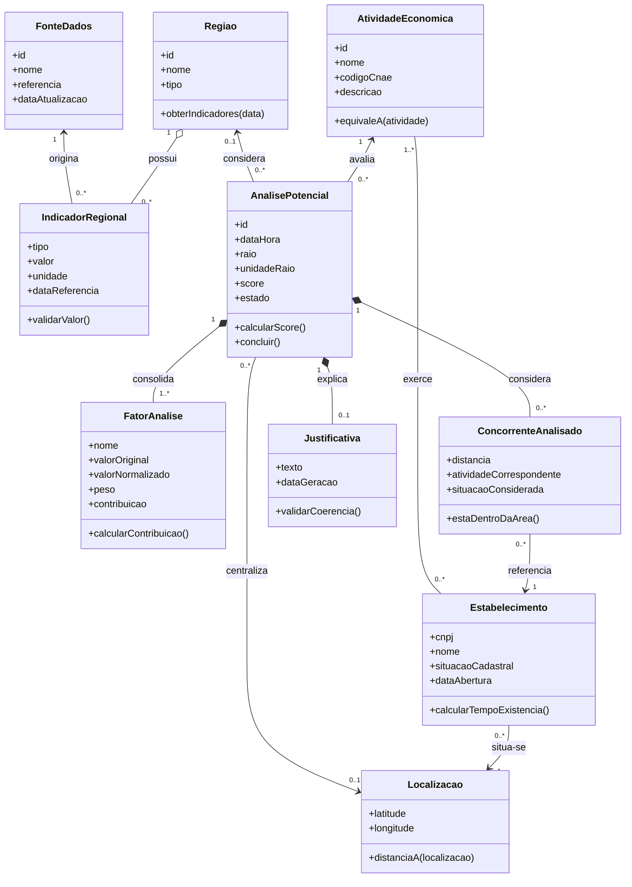

# Modelo Inicial de Classes - RightPoint

## Estado

Proposta inicial derivada do minimundo e das regras de negócio. Nomes, atributos e cardinalidades devem ser validados pelo grupo antes da entrega final.

## Classes e responsabilidades

| Classe | Responsabilidade | Atributos principais | Comportamentos principais |
| --- | --- | --- | --- |
| `AtividadeEconomica` | Representar o tipo de negócio analisado. | id, nome, código CNAE, descrição | verificar equivalência com outra atividade |
| `Regiao` | Representar um recorte territorial. | id, nome, tipo | fornecer indicadores vigentes |
| `Localizacao` | Representar um ponto geográfico. | latitude, longitude | calcular ou solicitar distância até outro ponto |
| `IndicadorRegional` | Registrar uma medida da região. | tipo, valor, unidade, data de referência | validar valor conforme o tipo |
| `FonteDados` | Identificar a origem de um dado. | id, nome, referência, data de atualização | informar procedência do dado |
| `Estabelecimento` | Representar uma empresa existente. | CNPJ, nome, situação cadastral, data de abertura, localização | informar tempo de existência e elegibilidade cadastral |
| `AnalisePotencial` | Agregar parâmetros e resultado de uma avaliação. | id, data, raio, unidade, score, estado | validar entrada, concluir análise e preservar snapshot |
| `FatorAnalise` | Registrar a contribuição de um indicador para o score. | nome, valor original, valor normalizado, peso, contribuição | calcular contribuição |
| `ConcorrenteAnalisado` | Registrar por que um estabelecimento entrou na concorrência. | distância, atividade correspondente, situação considerada | verificar se está dentro da área |
| `Justificativa` | Explicar o resultado com base nos fatores. | texto, data de geração | validar referências aos fatores usados |

## Diagrama de classes

## Invariantes do modelo

- uma análise deve possuir uma atividade;
- uma análise deve possuir região, localização ou ambas;
- uma análise concluída deve possuir fatores, score válido e justificativa;
- cada concorrente analisado deve referenciar um estabelecimento;
- indicadores e estabelecimentos usados no cálculo devem ter origem rastreável.

## Pontos para validação

- inclusão de uma classe `Empreendedor`, caso cadastro e histórico por usuário entrem no escopo;
- representação de atividades principal e secundárias do estabelecimento;
- necessidade de uma classe separada para o snapshot histórico;
- cardinalidade entre análise, região e localização;
- métodos exigidos pela professora e nível de detalhe esperado no diagrama.
