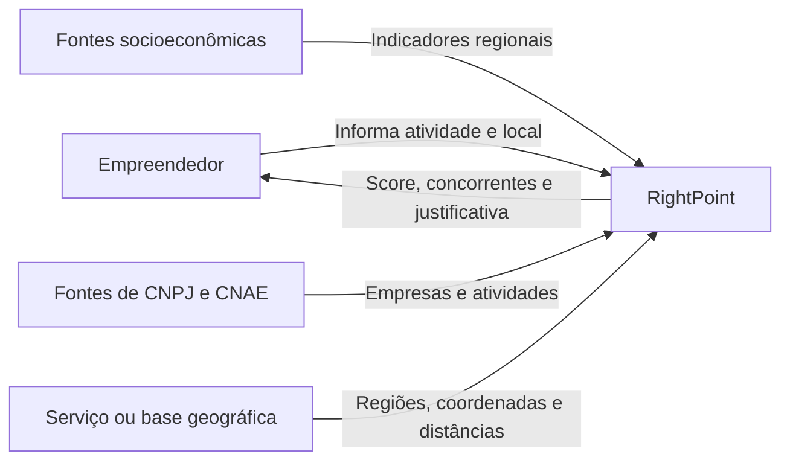

# Visão Geral da Arquitetura - RightPoint

## Estado

Arquitetura conceitual para orientar a modelagem. Tecnologias, banco de dados e forma de implantação ainda não foram escolhidos.

## Objetivo arquitetural

Separar a consulta do usuário, a obtenção de dados públicos, a análise de potencial e a preservação do resultado. Essa divisão permite alterar fontes e critérios de cálculo sem mudar o objetivo central do sistema.

## Contexto do sistema

## Responsabilidades principais

- receber atividade, referência geográfica e raio da consulta;
- validar os dados necessários para iniciar a análise;
- localizar indicadores da região;
- identificar estabelecimentos concorrentes;
- transformar dados heterogêneos em fatores comparáveis;
- calcular e explicar o score;
- preservar o resultado e os dados usados quando houver histórico.

## Componentes conceituais

| Componente | Responsabilidade |
| --- | --- |
| Interface de consulta | Coletar os parâmetros e apresentar o resultado. |
| Catálogo de atividades | Manter atividades e sua relação com CNAEs ou categorias. |
| Contexto geográfico | Resolver regiões, coordenadas, raios e distâncias. |
| Integração de dados | Obter e normalizar dados públicos. |
| Análise de concorrência | Selecionar estabelecimentos relevantes para a consulta. |
| Motor de potencial | Calcular fatores, score e nível de confiança, se adotado. |
| Gerador de justificativa | Explicar o resultado usando os fatores calculados. |
| Histórico de análises | Preservar resultados e snapshots para rastreabilidade. |

## Princípios

- rastreabilidade entre resultado, fatores e fontes;
- explicação compreensível do score;
- preservação do contexto histórico;
- tratamento explícito de dados ausentes;
- baixo acoplamento com fornecedores de dados específicos.

## Decisões pendentes

- arquitetura de implantação;
- tecnologias de frontend, backend e banco;
- execução síncrona ou assíncrona das análises;
- atualização sob demanda ou periódica das fontes;
- persistência obrigatória ou opcional do histórico;
- fórmula, pesos e versionamento do algoritmo de score.
